# Finance Tracker

A full-stack personal finance tracker: track income and expenses, set monthly
budgets, and visualize spending. A Spring Boot REST API backed by MySQL, with
a React (Vite) frontend.

## Features

- JWT authentication - register, login, BCrypt-hashed passwords
- Transactions - full CRUD, categorized as income or expense
- Budgets - one per month, with live spend tracking and an over-budget warning
- Dashboard - balance/income/expenses/savings at a glance, an expense
  breakdown, and a 6-month income vs. expense trend
- Reports - the same breakdown and trend, filterable by Today / Week / Month / Year
- Profile - update your details, change your password, or delete your account
- Light/dark theme, remembered per device

## Tech Stack

**Backend** — Java 17 · Spring Boot 3.5 · Spring Security · JWT · Spring Data JPA · Hibernate · MySQL · Maven
**Frontend** — React 19 (Vite) · Tailwind CSS v4 · React Router · Axios · Recharts

## Status

Built in phases, each one runnable and reviewed before the next started.

- [x] Phase 1 — Project setup, folder structure, dependencies, DB config
- [x] Phase 2 — Authentication (register, login, JWT, BCrypt)
- [x] Phase 3 — Transactions (CRUD)
- [x] Phase 4 — Budget
- [x] Phase 5 — Dashboard (summary cards, charts)
- [x] Phase 6 — Reports (filters, trends)
- [x] Phase 7 — User profile
- [x] Phase 8 — Polish (light/dark theme toggle) + full documentation

## Documentation

- **[docs/INSTALLATION.md](docs/INSTALLATION.md)** — detailed setup, environment variables, troubleshooting
- **[docs/API.md](docs/API.md)** — every endpoint, request/response shapes, error format
- **[docs/DATABASE.md](docs/DATABASE.md)** — schema, ER diagram, key design decisions

## Project Structure

```
finance-tracker/
├── docs/                        API.md, DATABASE.md, INSTALLATION.md
├── backend/                     Spring Boot API
│   └── src/main/java/com/financetracker/
│       ├── FinanceTrackerApplication.java
│       ├── controller/           REST endpoints (Auth, Transaction, Budget, Dashboard, Report, Profile)
│       ├── service/              Business logic (interface + impl per feature)
│       ├── repository/           Spring Data JPA repositories
│       ├── entity/                User, Transaction, Budget, TransactionType, Category
│       ├── dto/                   Request/response records
│       ├── security/              JWT filter, JwtService, UserPrincipal, UserDetailsService
│       ├── config/                SecurityConfig, CorsConfig
│       ├── exception/             GlobalExceptionHandler + custom exceptions
│       └── util/                  EmailNormalizer, MonthlyTrendCalculator
└── frontend/                    React (Vite) client
    └── src/
        ├── App.jsx
        ├── components/            TransactionForm, TransactionList, charts, cards, ThemeToggle, ...
        ├── pages/                 Dashboard, Transactions, Budget, Reports, Profile, Login, Register
        ├── layouts/               DashboardLayout (nav), AuthLayout
        ├── services/               One Axios module per resource
        ├── hooks/                  useAuth, useTheme
        ├── context/                AuthContext, ThemeContext
        └── utils/                  formatters, categories, storage
```

## Getting Started

Quick version below; see **[docs/INSTALLATION.md](docs/INSTALLATION.md)** for prerequisites, environment variable reference, and troubleshooting.

### Backend
```bash
cd backend
export DB_USERNAME=root
export DB_PASSWORD=your_mysql_password
export JWT_SECRET=$(openssl rand -hex 32)
mvn spring-boot:run
```
Runs on **http://localhost:8080**. Run `mvn test` for the test suite (uses an in-memory H2 database, no MySQL needed for tests).

### Frontend
```bash
cd frontend
cp .env.example .env
npm install
npm run dev
```
Runs on **http://localhost:5173**.

## Notes on version choices

- **Spring Boot 3.5.16 on Java 17** — the final patch on the 3.x line (3.x
  reached OSS end-of-life on 2026-06-30) targeting Java 17, Spring Boot 3's
  original baseline JDK. Spring Boot 4.1 is current if you'd rather move to
  that line later - it's a version bump plus some Spring Security config
  changes, not a rewrite.
- **Tailwind CSS v4** — configured via the `@tailwindcss/vite` plugin
  (no `tailwind.config.js`/PostCSS needed); theme and dark-mode variant
  live directly in `src/index.css`.
- **Recharts** over Chart.js for the dashboard charts — composes more
  naturally as React components. Easy to swap if you'd prefer Chart.js.
- **Theme toggle** — defaults to the OS/browser preference on first visit,
  then remembers whatever you explicitly pick from then on. An inline script
  in `index.html` applies the class before React even mounts, so there's no
  flash of the wrong theme on load.

# Screenshots
## Light Theme
| Login | Register |
|-------|----------|
| 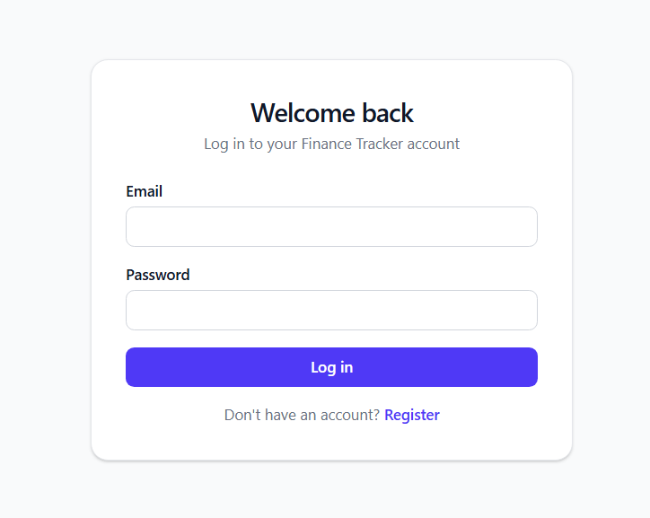 | 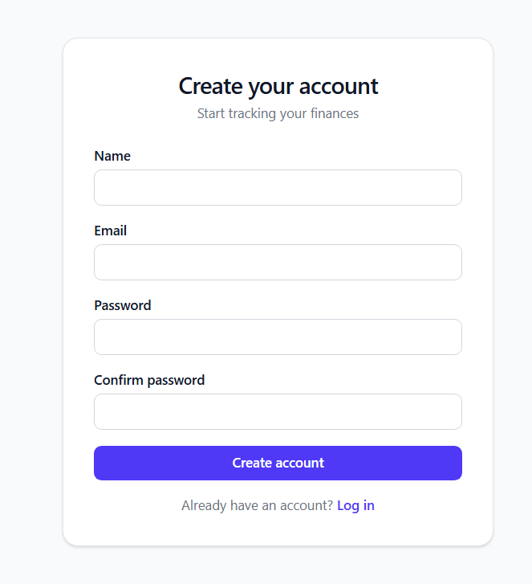 |

| Dashboard | Transactions |
|------------|--------------|
| 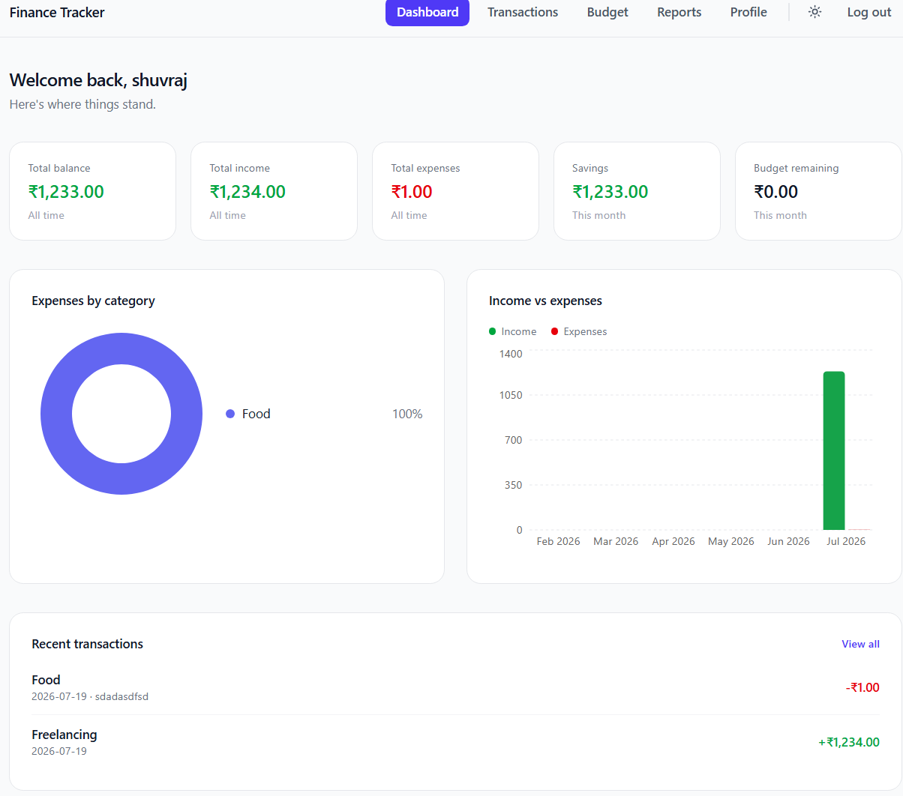 | 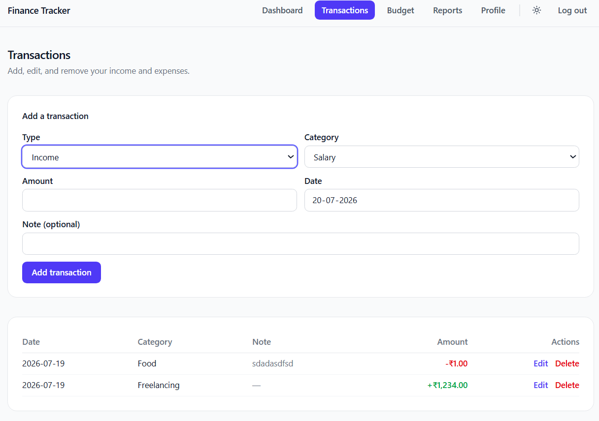 |

| Budget | Reports |
|---------|---------|
| 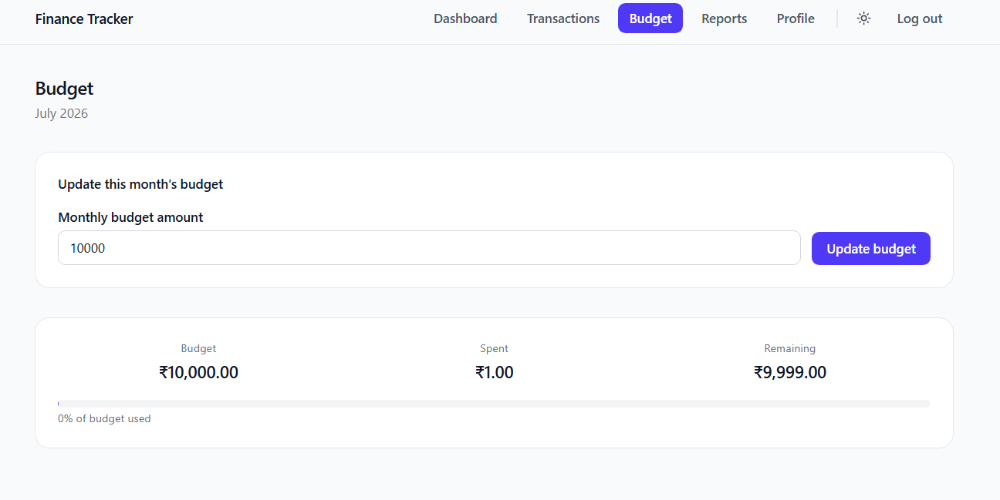 | 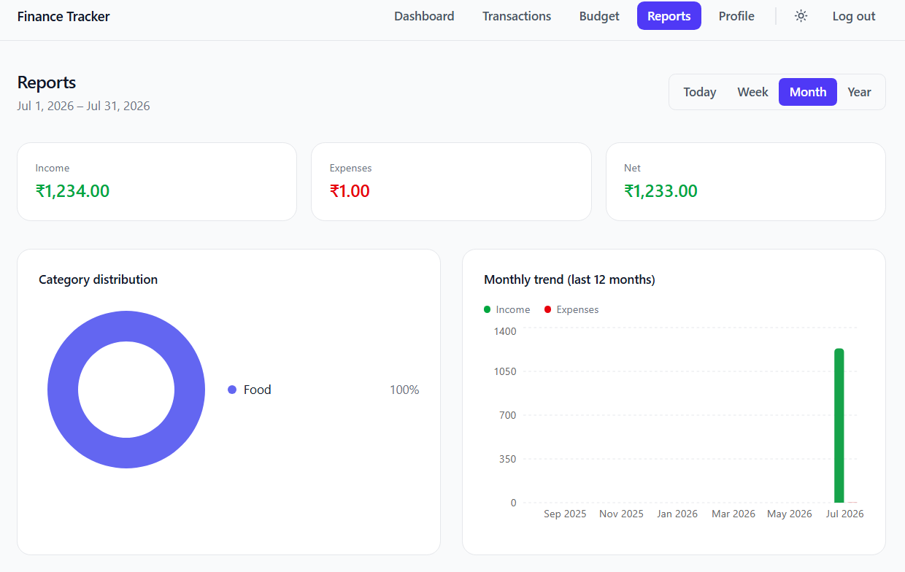 |

| Profile |
|---------|
| 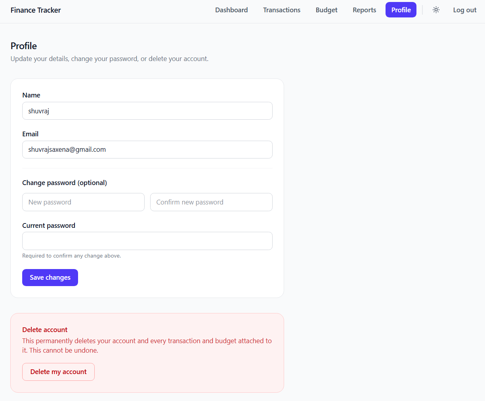 |

---

## Dark Theme
| Login | Register |
|-------|----------|
| 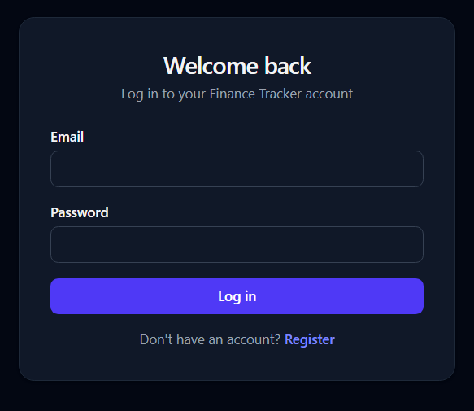 | 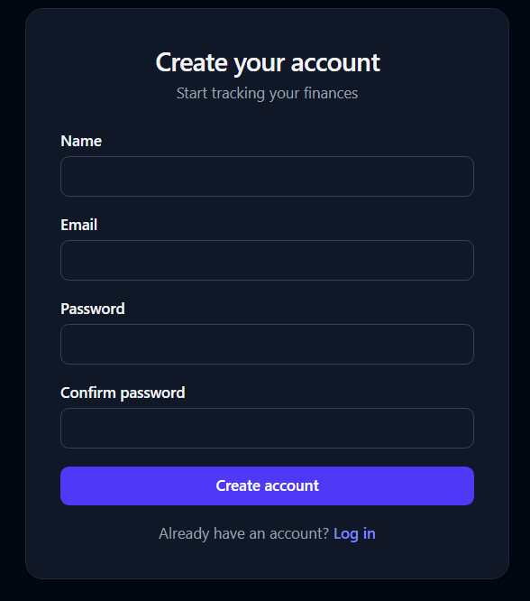 |

| Dashboard | Transactions |
|------------|--------------|
| 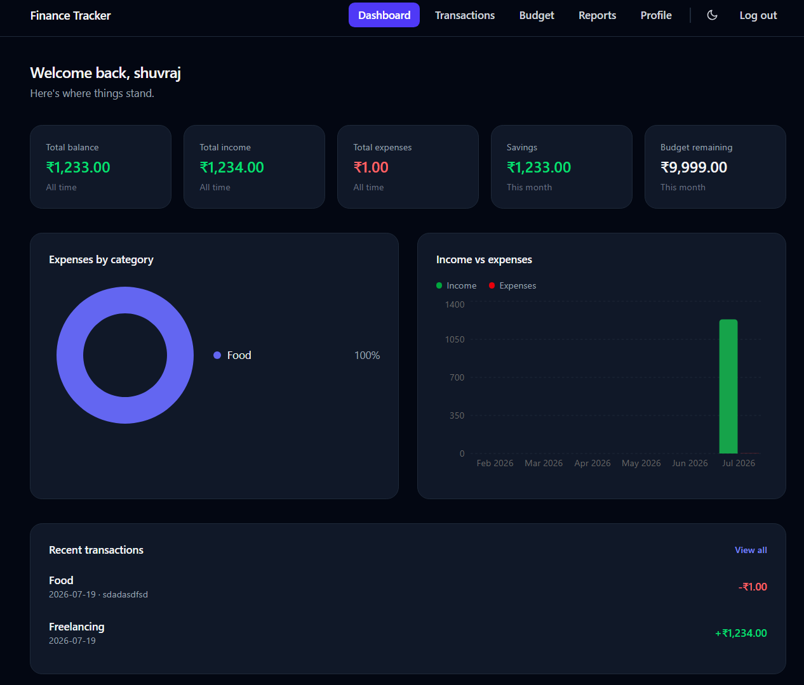 | 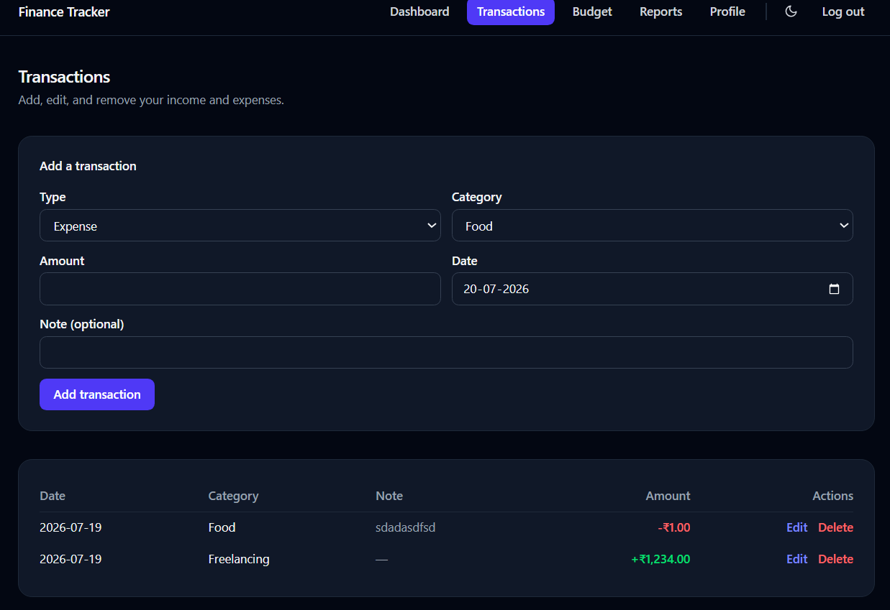 |

| Budget | Reports |
|---------|---------|
| 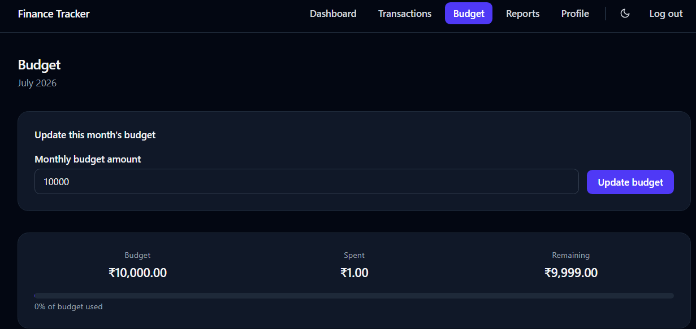 | 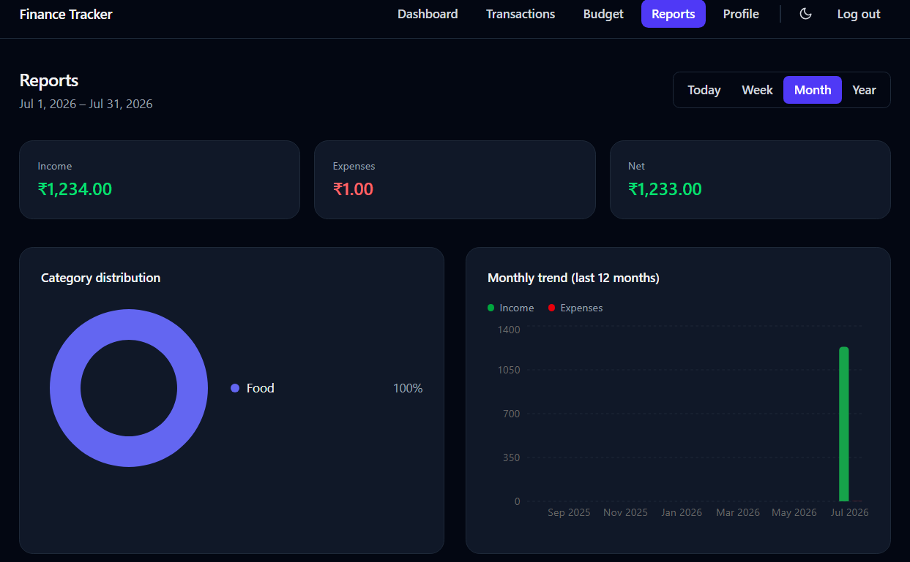 |

| Profile |
|---------|
| 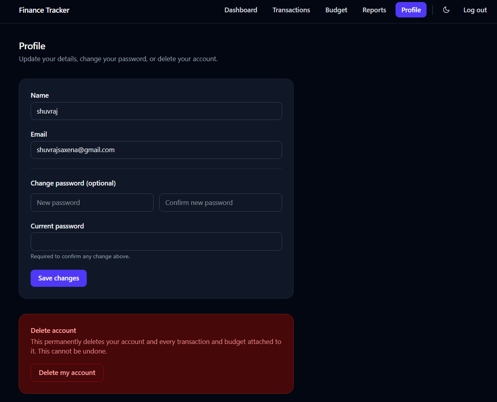 |

## License

This project is open-source and available for learning and educational purposes.
