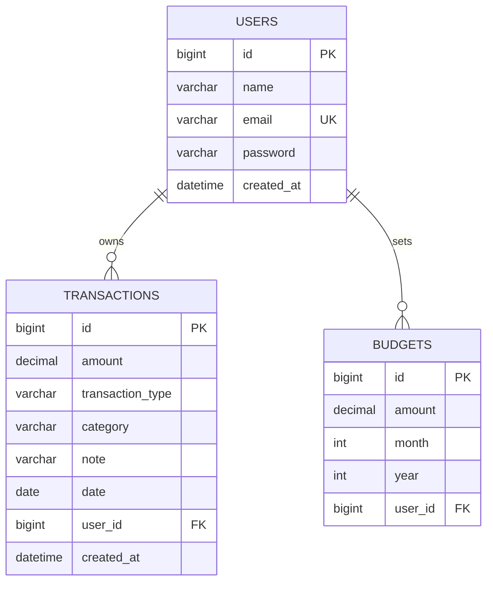

# Database Schema

MySQL, three tables. `ddl-auto: update` (Hibernate) creates and evolves these automatically from the entity classes in `entity/` - there's no separate SQL migration file to keep in sync.

## Entity-relationship diagram

Both `TRANSACTIONS` and `BUDGETS` reference `USERS` with a one-way `@ManyToOne` - there's no inverse `@OneToMany` collection on `User`. Nothing in the app ever queries "give me this user's transactions" by walking the User side; it's always a direct, indexed lookup (`WHERE user_id = ?`), so the inverse side would just be unused surface area with its own lazy-loading footguns.

## `users`

| Column | Type | Constraints |
|---|---|---|
| `id` | `BIGINT` | Primary key, auto-increment |
| `name` | `VARCHAR` | Not null |
| `email` | `VARCHAR` | Not null, **unique**, normalized to lowercase before every read/write |
| `password` | `VARCHAR` | Not null - a BCrypt hash, never the plaintext |
| `created_at` | `DATETIME` | Not null, set once on insert (`@CreationTimestamp`), never updated |

## `transactions`

| Column | Type | Constraints |
|---|---|---|
| `id` | `BIGINT` | Primary key, auto-increment |
| `amount` | `DECIMAL(12,2)` | Not null - `BigDecimal` in Java, never `double`/`float`. Floating-point binary types can't represent most decimal fractions exactly, which is the wrong failure mode for money |
| `transaction_type` | `VARCHAR(20)` | Not null - `INCOME` or `EXPENSE`, stored as the enum name (`@Enumerated(EnumType.STRING)`), not its ordinal, so the column stays readable and doesn't silently break if the enum is ever reordered |
| `category` | `VARCHAR(20)` | Not null - see [Categories](#categories) below |
| `note` | `VARCHAR(500)` | Nullable |
| `date` | `DATE` | Not null - the transaction's own date, distinct from `created_at` |
| `user_id` | `BIGINT` | Not null, foreign key → `users.id` |
| `created_at` | `DATETIME` | Not null, set once on insert |

## `budgets`

| Column | Type | Constraints |
|---|---|---|
| `id` | `BIGINT` | Primary key, auto-increment |
| `amount` | `DECIMAL(12,2)` | Not null |
| `month` | `INT` | Not null, 1-12 |
| `year` | `INT` | Not null |
| `user_id` | `BIGINT` | Not null, foreign key → `users.id` |

**Unique constraint on `(user_id, month, year)`** - a user can only ever have one budget per calendar month. Enforced at the DB level, on top of the application-level check in `BudgetServiceImpl` (checked first, so the normal "you already have a budget this month" case gets a clean 409 rather than a raw constraint-violation error; the DB constraint is the backstop against a race condition, not the primary defense).

## Categories

A single `Category` enum covers both transaction types, rather than two separate `IncomeCategory`/`ExpenseCategory` enums - each constant knows which `TransactionType` it's valid for (see `Category.isValidFor()`), so that rule lives in exactly one place.

| Expense | Income |
|---|---|
| `FOOD` | `SALARY` |
| `TRANSPORT` | `FREELANCING` |
| `SHOPPING` | `INVESTMENTS` |
| `BILLS` | `BONUS` |
| `ENTERTAINMENT` | |
| `MEDICAL` | |
| `RENT` | |
| `OTHERS` | `OTHERS` (shared - valid for either type) |

Sending a mismatched pair (e.g. `transactionType: INCOME` with `category: FOOD`) is rejected with a `400` - the frontend's category dropdown is also filtered by the selected type, so this is a backend safety net for direct API calls, not something reachable through the UI.

## On deleting a user

`DELETE /api/profile` explicitly deletes the user's transactions and budgets *before* deleting the `users` row, rather than relying on a database-level `ON DELETE CASCADE`. `ddl-auto: update` doesn't reliably retrofit cascade behavior onto a foreign key that already exists from an earlier schema version, so explicit application-level cleanup (`TransactionRepository.deleteByUserId` / `BudgetRepository.deleteByUserId`) works regardless of when your local database was first created.

## For production

`ddl-auto: update` is convenient for a project that's actively growing its schema in development, but it isn't meant to be the long-term story - it can add tables/columns but won't safely handle things like renaming a column or changing a constraint on existing data. A real deployment would swap this for versioned migrations (Flyway or Liquibase) with `ddl-auto: validate`, so schema changes are explicit, reviewable files instead of something Hibernate infers at startup.
